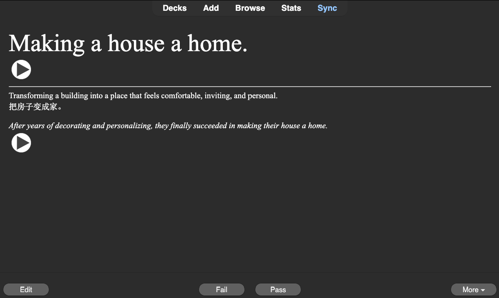

# Anki Deck Generator

This project is a Python application and CLI that generates Anki decks for English learners using OpenAI's GPT-3 and TTS models.\\
I wrote this app so that I can quickly generate Anki flashcards for my English students.
Once you create a deck using the CLI tool, you can generate .apkg files using the `generate` command and import them into Anki.
Files generated under the same deck name (using the CLI) tool will be imported into Anki under the same (Anki) deck, essencially just adding new cards to that Anki deck.



The resulting Anki cards include the following fields:\
(Frontside)

-   Term
-   Term audio

(Backside)

-   English definition
-   Native language translation
-   Example sentence
-   Example sentence audio

## Getting Started

### Prerequisites

-   Python 3.8 or higher
-   An OpenAI API key

### Installation

1. Clone the repository:

```sh
git clone https://github.com/tebby24/genankiai.git
```

2. Install the required Python packages:

```sh
pip install -r requirements.txt
```

3. Set up your OpenAI API key in a `.env`

```sh
echo "OPENAI_API_KEY=yourapikey" > .env
```

### Usage

Use the CLI by running `python cli.py`
The CLI tool provides several commands to manage and generate Anki decks.
You can modify the output output and decks directory used by the CLI by modifying the `settings.json` file.

### Creating a new deck

To create a new deck, use the `newdeck` command.
You need to provide the name of the deck and the native language (used for the translation field) of the deck's user.
The deck name cannot include spaces.

```bash
python cli.py newdeck --name "my_deck" --native-language "Chinese"
```

### Generating a deck

To generate a deck, use the `generate` command. You need to provide the name of the deck.

```bash
python cli.py generate "my_deck"
```

### Listing all decks

To list all available decks, use the `listdecks` command.

```bash
python cli.py listdecks
```

### Editing a deck

To edit a deck's .json file, use the `editdeck` command. You need to provide the name of the deck.

```bash
python cli.py editdeck "my_deck"
```

### Deleting a deck

To delete a deck, use the `deletedeck` command. You need to provide the name of the deck.

```bash
python cli.py deletedeck "my_deck"
```

Please replace `"My Deck"` and `"English"` with your actual deck name and native language.

### Credits

This project uses https://github.com/kerrickstaley/genanki
